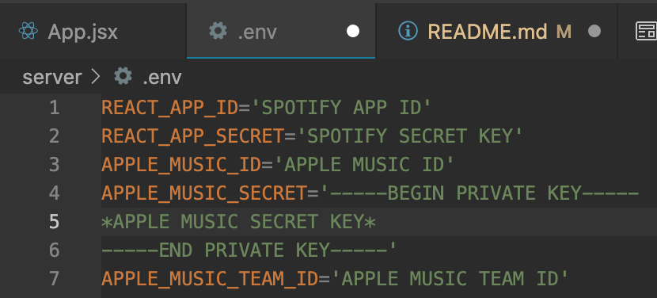

# camb.io: Spotify to Apple Music Playlist Converter

## Description:

A React App that takes a Spotify Playlist URL and transfers the playlist to the user's Apple Music Library.

## Run the Project Locally:

### Warning: To run this app locally, you'll first need to set up developer accounts for both Apple and Spotify. Uma Abu has a great video on how to do this (https://www.youtube.com/watch?v=mS2J0dKcvAA&t=1s).
1. After cloning the project repo, run the command `yarn` in both the `client` and `server` directories.
2. Create an .env file in the server directory with both the Apple and Spotify client credentials (example below).
 
   
3. Run command `yarn start` in the `server` directory and secondly in the `client` directory.
4. Open [http://localhost:3000](http://localhost:3000) to view it in your browser.

### Note: I've noticed some incompatibility issues with the Chrome plugin `Night Mode Pro`, I'm working to resolve this.

## Converting a Playlist:

1. Ensure the Spotify playlist is public, then copy and paste the playlist URL into the search bar.
2. Press enter. (A playlist card should appear along with a new text field)

3. Either create a new playlist name with the text field or press enter (defaults to Spotify playlist name).
4. Authenticate with your Apple Music account.
5. When Transfer is complete, a pop up appears that displays the tracks that couldn't be found.

6. The playlist will now be in the user's Apple Music Library!

## Credits:
Many thanks to Uma Abu, his playlist converter project was invaluable to creating this application! Check it out at https://github.com/ueabu/spotify-to-apple-music.
